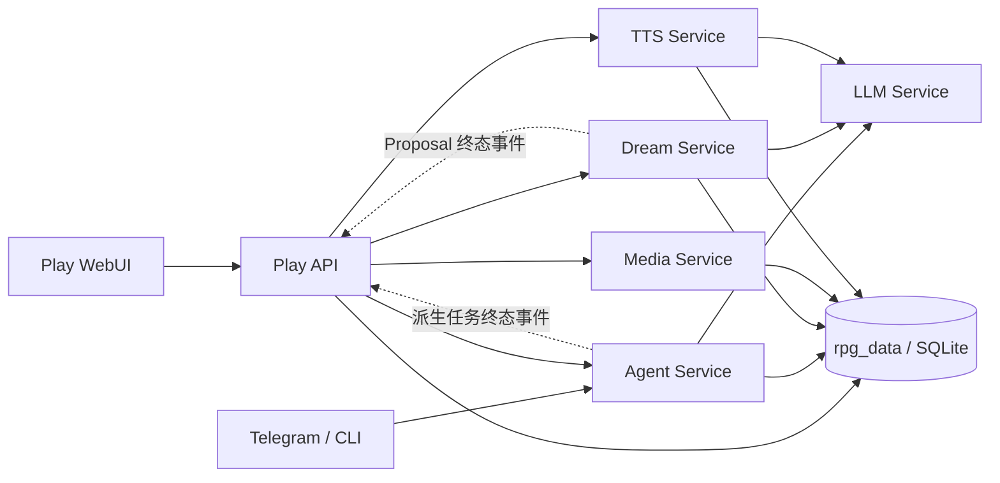

# RPG World 项目速览（AI 交接版）

> 更新时间：2026-07-29
>
> 这是一份面向接手 AI 的概念地图，刻意省略开发规约、边界守卫、配置细节和测试清单。需要落实修改时，再查 `CLAUDE.md` 与对应专题文档。

## 一句话理解

RPG World 是一个面向长期游玩的、有状态的 AI 文字 RPG 平台。它的目标不是让 LLM 临时扮演一个聊天角色，而是让 Story、Session、角色、场景、世界状态、剧情推进和多层记忆共同组成一个可持续演化的 RPG 世界。

核心思路是：**LLM 负责理解、裁定和叙事，系统负责保存事实、组织上下文、控制流程并保证一次回合的一致性。**

## 产品背景与方向

- **Play WebUI 是主产品体验**：玩家在这里管理故事、选择角色、进行沉浸式 RP、查看场景与状态、管理剧情调度、长期记忆、图片和语音。
- **Telegram 与 CLI 是轻量渠道**：复用同一 Session 和 Agent 能力，适合快速回复、通知和兜底，不承载复杂管理体验。
- 一个 Story 是可复用的“世界与玩法定义”，一个 Session 是实际发生、可分支、持续积累状态的“游玩实例”。
- 当前系统已经覆盖聊天主链路、角色与世界资料、状态更新、剧情调度、多层记忆、Dream、图片、TTS 和后台通知；现阶段重点是继续打磨 Play WebUI 和跨服务生命周期的稳定性。

## 最重要的领域模型

| 层级 | 含义 | 主要内容 |
| --- | --- | --- |
| Workspace | 数据与资源容器 | 多个 Story、共享的运行目录与媒体资产 |
| Story | 一套 RPG 定义 | Story Prompt、Openings、角色、世界书、状态表定义、RP Modules、剧情大纲与事件池 |
| Session | 一条实际游玩时间线 | 玩家角色绑定、开局、消息历史、当前 Scene、运行时状态、裁定与剧情账本、摘要、记忆、媒体与语音 |

Session 创建时绑定 Workspace 和 Story，之后主要通过全局短 `session_id` 定位。Story 保存“这局游戏可以是什么”，Session 保存“这局游戏已经发生了什么”。

## 整体设计思路

1. **世界事实不寄存在模型脑中**

   消息、Scene、状态表、剧情决策、记忆和资源都有自己的持久化真源。LLM 每回合读取系统组装出的快照，生成结果后再由系统提交。

2. **定义与运行态分离**

   Story 持有角色、世界书、状态定义和玩法上限；Session 在此基础上形成独立的角色绑定、状态副本、历史和剧情分支。

3. **上下文是结构化产品，不是一段巨型 Prompt**

   系统分别组织稳定设定、长期记忆、摘要、近期历史、剧情记忆、当前状态、动态召回、玩法运行态和玩家输入，最后在 LLM 边界统一渲染。

4. **一个 Turn 是可提交或丢弃的工作单元**

   用户消息、裁定、剧情选择、Scene/状态变化和回复先进入本轮 scratch；主流程完整成功后一起提交，取消或模型失败则不留下半个回合。

5. **聊天主链路与派生能力解耦**

   Dream、图片、TTS、摘要和剧情记忆提取是独立能力。它们失败时，基础聊天仍应继续工作。

6. **业务、数据与接入层分开**

   `rpg_core`、`rpg_memory`、`rpg_media`、`rpg_tts` 表达业务；`rpg_data` 负责可靠持久化；FastAPI 服务、WebUI、Telegram 和 CLI 负责接入与协议适配。

## 运行架构



- **Agent Service**：持有每个 Session 的 Agent runtime，串行处理同一 Session 的消息与命令，并编排完整 Turn。
- **LLM Service**：统一管理远端模型、本地 llama、Embedding、Rerank 和 Speech 等 Provider 能力。
- **Dream Service**：离线提炼长期稳定事实，生成可审核 Proposal，并应用到 Persistent Memory。
- **Media / TTS Service**：处理持久任务、资产存储、重试与恢复；它们不占用聊天主链路。
- **Play API**：WebUI 的统一后端入口，代理各独立服务，同时提供 Story/Session 管理和只读聚合。
- **`run_all.py`**：只是方便本地启动上述后端进程的编排入口。

## Core Agent 与 Sub-Agent 设计

Agent Service 按全局 `session_id` 缓存一个 `RPGGameAgent`。`RPGGameAgent` 本身不是堆积所有逻辑的“大 Agent”，而是一个 **composition root + public facade**：负责组装协作者，并向外提供初始化、同步/流式发送、取消、命令和 Session 操作入口。

```text
AgentManager
└── RPGGameAgent（每个 Session 一个运行实例）
    ├── AgentMailbox
    │   └── Turn、命令、历史 mutation 与派生物化的 FIFO / 取消
    ├── AgentRuntimeLifecycle
    │   └── Session 资源、Sub-Agent、Summary Compressor 的创建与重绑
    ├── AgentSessionService
    │   └── 角色、历史、reset、reload 等 Session 操作
    ├── AgentDerivationService
    │   └── Session 分支物化及状态、记忆、摘要重建
    ├── MainModelRuntime
    │   └── 主模型选择与本轮模型快照
    ├── AgentContextService
    │   └── 结构化 Context、Preview 与窗口门禁
    ├── AgentToolService
    │   └── 基础工具、查询工具与本轮工具/schema
    ├── AgentTurnService + TurnOrchestrator
    │   └── 同步/流式共用的 Turn 业务模板
    ├── CommandDispatcher
    └── Sub-Agents
        ├── StatusSubAgent
        └── MemorySubAgent
```

每个 Session 的 Context 协作者被装进不可变的 `AgentContextResources`，其中包括 Context Builder、角色、世界书、状态、Scene 和在线 Memory Manager。Session reload 或资源变化时会整体替换这一组引用，再统一重绑 Sub-Agent、工具和记忆存储，避免一次 Turn 混用新旧世界状态。

主 Agent 是最终的叙事执行者；Sub-Agent 是固定流程中的专用处理器，并不是可以自行扩张任务的多 Agent 群。它们通过独立业务键选择 LLM Provider，共享轻量的世界书、角色卡与玩家角色上下文，但只在自己的窄职责内工作。

| 组件 | 时机 | 职责 | 结果去向 |
| --- | --- | --- | --- |
| `StatusSubAgent` | 主 Agent 之前 | 按固定的 Outcome 判断 → 状态目标路由 → Scene/单表更新流程预处理本轮事实；派生 Session 时也负责状态重建 | 只修改本轮 scratch；各状态目标可独立回退，最终随 Turn 一起提交 |
| `MemorySubAgent` | Commit 后、手动命令或 Session 派生期间 | 提取 Story Memory，生成 batch/overall Summary，并支持历史压缩 | 写入派生记忆、摘要及处理进度；普通 post-commit 失败不回滚已提交回复 |

在线 Memory Recall 不由 `MemorySubAgent` 完成：它由 `MemoryRecallHook` 在主 Context 构建前调用 `rpg_memory` 的 Recall Manager。前者负责“为当前 Turn 找相关旧信息”，后者负责“从已发生剧情生产可长期复用的派生资料”。

## 一次普通 Turn 如何运行

```text
TurnRequest
  → 固化本轮角色、模型、记忆、RP Module 与剧情快照
  → 检查上下文窗口
  → Outcome 预裁定与 Scene/状态预更新
  → Plot Scheduler 选择本轮剧情指令
  → 在线 Memory Recall
  → 组装结构化 Context 与本轮工具
  → 主 Agent 调用 LLM / Tools 生成正文
  → 原子提交消息、裁定、剧情决策和状态变化
  → 提交后异步处理 Story Memory 与 Summary
```

同步和流式回复共用这条业务流程；区别主要在模型输出和传输适配。同一 Session 的 Turn 按 FIFO 串行，不同 Session 可以并发等待模型与记忆服务。

## Context 与记忆的心智模型

主 Agent 看到的 Context 大致按以下层次组成：

```text
稳定系统与 Story 设定
→ Persistent Memory
→ Summary
→ 近期原始历史
→ Story Memory
→ 当前状态表
→ 动态召回记忆
→ 本轮 RP Module 运行态
→ 当前 Scene + 玩家输入 + 可选剧情指令
```

几类“记忆”解决的问题不同：

| 类型 | 作用 |
| --- | --- |
| History | 已提交对话的精确事实真源 |
| Summary | 压缩较老对话，控制上下文体积 |
| Story Memory | 从剧情中持续提取的叙事细节 |
| Persistent Memory | 经 Dream 提炼和审核的长期稳定世界事实 |
| Recalled Memory | 根据当前输入从索引中临时召回的相关材料 |

`rpg_memory` 负责 RPG 语义、来源有效性和在线/离线编排；`memory_retrieval` 只提供通用的向量、关键词、原文、融合与重排能力。

## 当前主要玩法能力

- **玩家角色与 Opening**：Session 绑定一个玩家角色，并以所选 Opening 建立第一段有效历史。
- **Message Mode**：`neutral / ic / ooc / gm` 表达普通推进、角色内、场外讨论和 GM 托管等不同意图。
- **Narrative Outcome**：当行动存在实质不确定性时，生成五级叙事结果，让随机性服务于剧情分支，而不是把骰子细节直接交给模型。
- **Scene 与状态表**：Scene 表达当前时空和场景；普通状态表保存需要每回合可见、可即时更新的世界或角色状态。
- **Plot Scheduler**：Story 可配置线性大纲和事件池，系统根据 Scene 变化、时间、冷却和 LLM 适宜性判断，在合适 Turn 注入剧情指令。
- **Dream**：从历史或派生记忆中提炼长期事实，先生成 Proposal，用户确认后再改变 Persistent Memory。
- **Media 与 TTS**：从已提交内容派生图片与语音，资产与任务独立保存。

## 代码地图

| 目录 | 角色 |
| --- | --- |
| `play_webui/` | Next.js / React 玩家主界面 |
| `play_api/` | WebUI 的 FastAPI 聚合与代理层 |
| `agent_service/` | Agent HTTP/SSE 服务与 runtime |
| `rpg_core/` | Agent、Turn、Context、Session、Status、Scene、RP Modules 等核心业务 |
| `rpg_data/` | SQLite、Peewee、typed data services、事务与查询 |
| `rpg_memory/` | Recall、Story Memory、Persistent Memory、Dream 业务 |
| `memory_retrieval/` | 与 RPG 无关的检索基础设施 |
| `llm_service/`、`llm_client/` | 模型能力服务及其异步客户端 |
| `rpg_media/`、`media_service/` | 图片领域与任务服务 |
| `rpg_tts/`、`tts_service/` | 语音领域与任务服务 |
| `channels/` | Telegram、CLI 与轻量 Session 资料读取 |
| `DesignProject/`、`rpg_mcp/` | 面向 AI/工具的 Story 设计工程与运行时同步入口 |

后端以 Python 3.11、FastAPI、Peewee 和 SQLite 为主；前端是 Next.js 15、React 19 与 TypeScript。
